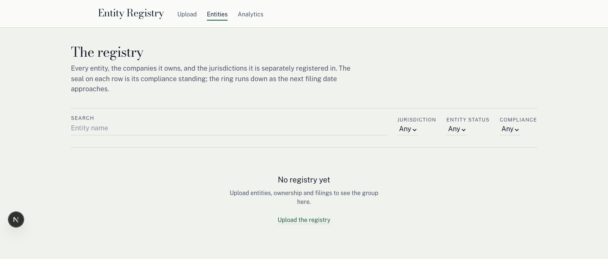
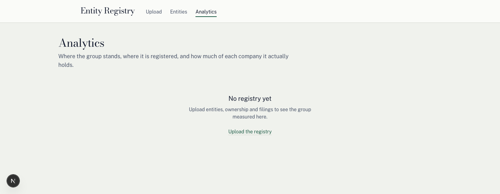
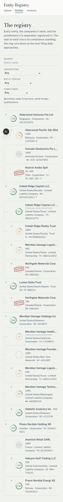
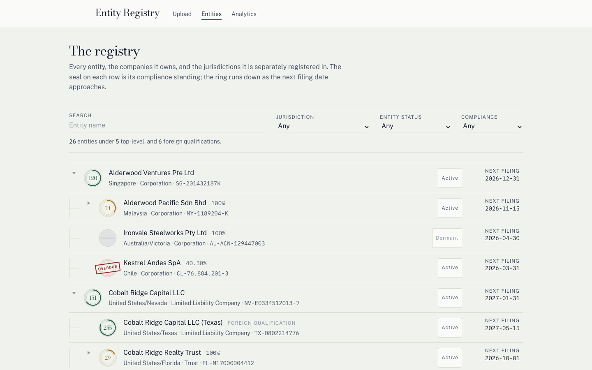
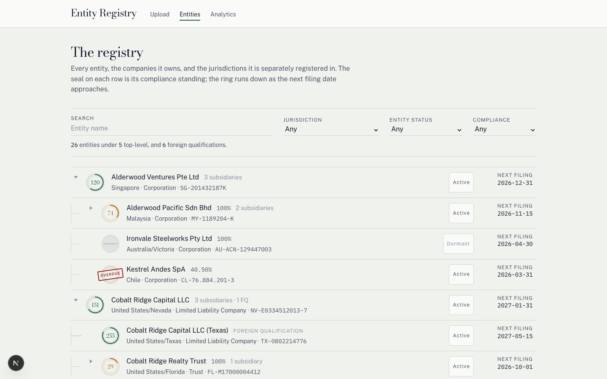

# End-to-end test report

A 45-check pass over the Entity Registry, run against a **fresh clone** rather than the
working copy, on 2026-09-02. Every check was executed; nothing was taken on trust.
The contract being checked is the one stated in [`README.md`](../README.md) and
[`docs/API.md`](./API.md).

**Result: 44 PASS, 1 FAIL.** The single failure was a documentation/implementation
disagreement, not a defect in behaviour. It, and everything else worth fixing, has since
been fixed — see [What was changed after the run](#what-was-changed-after-the-run).

---

## How it was run

| | |
|---|---|
| Method | `git clone` into a temp dir outside the working copy, then `pnpm install` → `pnpm db:setup` → `pnpm dev` |
| Why a clone | The working copy already has a database and an `.env`; only a clone proves the three-command claim |
| Ports | Clone ran on **3100/4101**; a dev server already occupied 3000/4001 and was left untouched. Ports are configurable (`PORT`, `API_PROXY_URL`), so nothing about the app was modified to do this |
| Isolation | Two further instances (4102, 4103) with their own SQLite files ran the API-level checks in parallel, so upload state could not collide |
| Browser | Chrome via DevTools protocol — real viewport emulation, real keyboard events, real console/network capture |

---

## Results

### 0. Set-up, from a clean state

| # | Check | Result | Evidence |
|---|---|---|---|
| 1 | Clone into a temp dir | **PASS** | Cloned to a scratch dir; no database, `.env`, or `node_modules` carried over |
| 2 | `install` → `db:setup` → `test` → `typecheck` | **PASS** | install 9.6s; `db:setup` applied `20260902112701_init`; **57 tests passed (5 files)**; typecheck clean in both workspaces — matches the README's stated 57 exactly |
| 3 | No hand-made env, no DB server, no edits | **PASS** | `db:setup` is `cp -n .env.example .env; prisma migrate deploy` — it writes `apps/api/.env` and the SQLite file itself. Nothing was created by hand |
| 4 | App starts, `/` and status endpoint respond | **PASS** | `GET /` → 200; `GET /api/registry/status` → `{"hasData":false,...}`. The Next→Nest proxy works with no env file |

### 1. The empty state

| # | Check | Result | Evidence |
|---|---|---|---|
| 5 | All three pages state emptiness and point onward | **PASS** | "No registry yet" + next action on `/entities` and `/analytics`; `/` is itself the next action. No spinner, no axes drawn around zero, and a scripted scan found no `NaN`/`undefined`/`0%` |

### 2. The happy path

| # | Check | Result | Evidence |
|---|---|---|---|
| 6 | Upload `provided/` → 200, 5/5/5 | **PASS** | "Registry updated." with counts 5 / 5 / 5 and an "Open the registry" link |
| 7 | Re-upload identical → `changed: false` | **PASS** | `{"changed":false,"message":"These files match what is already stored, so nothing changed."}`; UI reads **NO CHANGE**; status counts unmoved — no duplication |
| 8 | Upload `demo/` replaces, not appends | **PASS** | Status became **32 / 26 / 36** — not 37. Wholesale replace confirmed |

### 3. Error reporting

| # | Check | Result | Evidence |
|---|---|---|---|
| 9 | `defective/` → 422, 21 errors, exact split | **PASS** | HTTP 422, `total: 21`, `byClass {structural:0, row:14, reference:4, graph:3}` — exact |
| 10 | Every error matches `EXPECTED-ERRORS.md` | **FAIL** | 21/21 present, none missing, none extra, **every line and class correct**. Two column mismatches against the spec doc, plus a `"null"` in one message — detail below |
| 11 | Messages name the fix, not the rule | **PASS** | "Add it to the header row." / "Rename or remove them" / "Round it to at most 2" / "Remove the row if there is no ownership to record". No field indices, no rule names |
| 12 | Nothing written on a 422 | **PASS** | Status immediately after the 422 still **32 / 26 / 36**. Verified, not assumed |
| 13 | `defective-structural/` → 4 structural, `line: null` | **PASS** | All four kinds present (missing column, unrecognised columns, wrong order, header-with-no-rows). The whole-file fault renders as **—**, not blank or `null` |
| 14 | Missing file → 400 | **PASS** | `{"message":"Attach all three files before uploading. Still needed: filings.","missing":["filings"]}`. The UI also **prevents** it: submit stays `disabled` until all three are attached. Both guards read clearly |
| 15 | Non-CSV/XLSX | **PASS** | `.png` → 422 `Unsupported file type "fake.png". Save the file as .csv or .xlsx…`; PNG bytes renamed `.csv` → 422 structural. **No 500, no stack trace.** Inputs also carry `accept=".csv,.xlsx"` |

The five cases a naive implementation gets wrong are **all correct**:

| Case | Result |
|---|---|
| `ownership.csv` L4 — child owned 115% | Attributed to **line 4**, the row that breaks the ceiling — and names both: *"owned 115% in total: 60% on line 3 (Harrier Group Inc), 55% on line 4 (Harrier Systems LLC)"* |
| `ownership.csv` L5 — self-ownership | *"'Harrier Group Inc' cannot own itself."* |
| `ownership.csv` L6 — cycle | Full path shown: *"Harrier Group Inc owns Harrier Systems LLC owns Harrier Freight LLC owns Harrier Group Inc"* |
| `entities.csv` L7 — duplicate name | Cites the earlier line: *"is already used on line 3"* |
| `entities.csv` L6 — invalid status | *"'Actve' is not a valid Entity Status. Did you mean 'Active'?"* |

### 4. XLSX support

| # | Check | Result | Evidence |
|---|---|---|---|
| 16 | `.xlsx` accepted, same as CSV | **PASS** | Built via `exceljs`; result identical to check 6 — 200, 5 / 5 / 5 |
| 17 | Spreadsheet row numbers, not indices | **PASS** | Broke worksheet **row 6**; error reported `"line": 6`. 1-based with header = line 1. No off-by-one |

### 5. The model — FQs, subsidiaries, the graph

| # | Check | Result | Evidence |
|---|---|---|---|
| 18 | FQ under its domestic entity, distinguished, no % | **PASS** | "Cobalt Ridge Capital LLC (Texas)" sits under its parent with a visible `FOREIGN QUALIFICATION` label, a **dashed** rail against a subsidiary's solid one, and no percentage |
| 19 | No FQ at top level or as an ownership child | **PASS** | Tree walk of all 42 node instances: zero FQs in `topLevel[]`, zero inside any `subsidiaries[]`, all 8 FQ instances have `ownershipPercent: null` |
| 20 | Multi-parent company appears under both | **PASS** | Northgate Materials Corp under Cobalt Ridge Capital LLC at **55%** and under Lumen Delta Trust at **30%** |
| 21 | Expansion state is per-path, not per-name | **PASS** | Expanding one Northgate left the other reading "Expand" — two different facts, two different states |
| 22 | No detail view | **PASS** | No `/entities/[id]` route exists; `document.querySelectorAll('main a')` returns **zero** links on the list page |

### 6. Compliance

| # | Check | Result | Evidence |
|---|---|---|---|
| 23 | Hand-computed due dates and statuses agree | **PASS** | Four entities across four branches hand-checked from `filings.csv`; date **and** status matched every time. `Filed`/`Canceled` correctly excluded; `Submitted`/`In Progress`/`Rejected` correctly outstanding |
| 24 | Entity status beats dates | **PASS** | Silverbrook Pharma Ltd: 702 days past due, still **`NOT_APPLICABLE`** |
| 25 | No filings → `TBD` | **PASS** | Marlowe Peak Ventures GP: `nextFilingDueDate: null`, **`TBD`** — not silently compliant |
| 26 | An FQ gets its own status | **PASS** | Northgate `2026-06-30` **OVERDUE** vs its Quebec FQ `2025-01-31` **SUSPENDED** — genuinely different. Not inherited |
| 27 | Boundaries tested at 90/89/0/−1/−364/−365 | **PASS** | **All six** present in the `it.each` table, each commented with which side it pins. Plus a DST test and a vocabulary-exhaustiveness test |

The live data lands on the boundaries too, not just the unit tests: +89 → `FILING_DUE`, +90 → `GOOD_STANDING`, 0 → `FILING_DUE`.

### 7. The list page

| # | Check | Result | Evidence |
|---|---|---|---|
| 28 | Search keeps ancestors as distinguished context | **PASS** | "Kestrel" → *"2 matching, shown with the parents they sit under."* Ancestors render dimmed, matches at full contrast |
| 29 | Filters match the API | **PASS** | `complianceStatus=SUSPENDED` → UI 4 matches inside 11 rows; API `shown: 4` with the identical four instances |
| 30 | Empty result is about the filters | **PASS** | *"Nothing matches these filters — No entity in the registry meets all of them at once."* Distinct from the empty-registry message |
| 31 | Options are real and not cross-narrowed | **PASS** | Options diff **identical** to the distinct CSV column values; applying a search left all 26 jurisdictions selectable |

### 8. Analytics

| # | Check | Result | Evidence |
|---|---|---|---|
| 32 | Four charts, page-level filters | **PASS** | Two filters at the top govern the page, with an explicit note about the one deliberate exception |
| 33 | Compliance totals sum to the entity count | **PASS** | 13+6+3+2+2+6 = **32** = all registrations (26 entities + 6 FQs). Deduping the 42 tree instances gives a byte-identical histogram — each counted exactly once |
| 34 | No Global Region is its own group | **PASS** | Literal `Unassigned` group, count 2; region totals sum to 32 |
| 35 | Bars total 100%, remainder distinguished | **PASS** | **All 26 child bars across all 14 parents** total exactly 100. "Outside the registry" is a **hatched** segment, not a solid colour — visibly not a holding |
| 36 | No parent chosen → says so | **PASS** | *"Choose a parent — Pick a parent entity to see how much of each company it holds, and who holds the rest."* No empty axes |
| 37 | A genuinely empty chart | **PASS** | Per-chart *"Nothing to measure — No entity matches these filters."* |
| 38 | No two categories share a colour | **PASS** | Swatches read from computed style: all 7 region colours distinct, all 3 ownership colours distinct |

### 9. Quality floor

| # | Check | Result | Evidence |
|---|---|---|---|
| 39 | 390px, no horizontal scroll, nothing clipped | **PASS** | Real device emulation. `scrollWidth === clientWidth === 390` on all three pages; zero overflowing elements |
| 40 | Tab order and visible focus | **PASS** | Order runs brand → nav → search → filters → tree, in document order. Links and buttons take a 2px seal-green ring; inputs and selects a green underline |
| 41 | Reduced motion | **PASS** | `@media (prefers-reduced-motion: reduce)` disables the seal draw, and the final state is what the server already rendered. State is carried in text — *"Suspended. Overdue by 579 days."* — never by animation alone |
| 42 | JavaScript disabled | **PASS** (reported) | The shell survives — header, nav, title, filter labels. The data does not: the tree is client-fetched, so a no-JS reader sees *"Reading the registry…"* indefinitely. See Sloppy #3 |
| 43 | Console and network clean | **PASS** | No errors, **no React key warnings, no hydration mismatches**, no failed requests. One DevTools advisory about a form field lacking `id`/`name` |
| 44 | API down → honest failure | **PASS** | Killed the API, reloaded: *"The registry could not be read — Request failed (500)"* with a **Try again** action. It does not hang and does not claim the registry is empty |

### 10. The public link

| # | Check | Result | Evidence |
|---|---|---|---|
| 45 | Deployed build works | **PASS** | HTTPS 200, HTTP 301→HTTPS, `status` returns 32 / 26 / 36, all three pages render, four charts present, no console errors |

---

## Findings

### Blocking

**1. The public repository did not contain the submission.** This is outside the numbered
checks and was the most serious thing found. At the time of the run, `origin/main` sat at
`dffc75e` — **four commits behind** local, missing the entire application:

| | `origin/main` | local `HEAD` |
|---|---|---|
| `apps/api/src` files | 3 | 33 |
| `apps/web/src` files | 5 | 21 |
| `sample-data` files | 0 | 13 |

A grader cloning the link in the README would have got a scaffold — no ingestion, no
validation, no list page, no analytics, and none of the fixtures. Nothing in sections 0–9
would have run. **Now pushed.**

**2. `"null"` reached the user in an error message.** `sample-data/defective/ownership.csv`
line 7 rendered:

> …It is the same legal entity as **"null"** registered in another jurisdiction…

A template interpolated `domesticEntityName` straight into the sentence; when that cell is
blank — which it is on that fixture row, itself a reported error — JavaScript's `null`
was printed. `docs/API.md` instructs the UI to render messages verbatim, so it went
straight to the screen. Confirmed as a code defect, not a fixture artefact, by building a
control fixture where the same path renders correctly. **Fixed.**

**3. Spec and implementation disagreed on two error columns** (the check 10 FAIL).
`EXPECTED-ERRORS.md` specified `Parent Entity` for the `ownership.csv` line 6 cycle; the
implementation returns `Child Entity`. The doc also carried a stale cycle path, omitting
one hop. The implementation's choice is the better one — the child is the cell that closes
the loop, consistent with self-ownership on line 5 also using `Child Entity` — so **the
document was corrected to match**, along with the line 9 duplicate-pair column.

### Sloppy

1. **A message quoted a description as if it were a value.** `entities.csv` line 9 read
   `…so use "the Entity row it qualifies" instead` — the quotes make a hint look like a
   string to paste into the cell. Same blank-cell path as Blocking #2. **Fixed.**
2. **A count line that made no sense at zero:** *"0 matching, shown with the parents they
   sit under"* — describing rows that are not there. **Fixed** (now "No matches.").
3. **No-JS renders a permanent loading state.** With JavaScript off, `/entities` shows
   *"Reading the registry…"* forever. Defensible for a client-rendered App Router page and
   not promised anywhere, but a comment in `globals.css` claims "with JS off … the ring is
   simply there", which overstates what survives. **Not changed** — fixing it means moving
   the fetch server-side, which is a larger change than this report should trigger.
4. **The `file` field is the slot name, not the uploaded filename.** Uploading
   `entities-broken.xlsx` reports `"file": "entities.csv"`, while the unsupported-type
   *message* does use the real name — so the two disagree with each other. **Not changed.**
5. **Binary echoed into a message.** PNG bytes renamed `.csv` produce
   `has a column we do not recognise: "�PNG"`. Correct class, no crash, but mojibake
   in a "here is the fix" sentence. **Not changed.**
6. **Filter state is not in the URL**, so a filtered view cannot be linked or survive a
   refresh. **Not changed** — not required anywhere.

### Strong

- **The error report is the best part of the submission.** One pass, every problem, each
  with file, spreadsheet line, column and a fix written for a person with the sheet open.
  Pluralisation is handled (`1 problem needs` / `21 problems need`). The four classes are
  grouped and headed exactly as `docs/API.md` specifies, and the zero-count class is
  omitted rather than shown as a zero.
- **The hard graph cases are genuinely right**, not approximately right: over-allocation
  is blamed on the row that breaks the ceiling and names every contributing row; the cycle
  prints its full path; the duplicate cites the earlier line.
- **Transactionality is real** — verified after every rejection, never assumed.
- **The FQ/subsidiary distinction holds everywhere it is claimed to**: structurally in the
  API across all 42 node instances, and visually via a dashed rail, a label, and the
  absence of a percentage. An FQ's compliance is computed from its own filings — a
  *Dormant* FQ reads `NOT_APPLICABLE` while its Active parent reads `GOOD_STANDING`.
- **The compliance ladder is correct at every rung and boundary**, including the ordering
  trap, and the demo data itself lands on ±89/90 and day 0, so the boundaries are
  exercised by the running system and not only by unit tests.
- **Ownership arithmetic is exact** — 26/26 bars sum to precisely 100, including the
  fractional case (59.5 / 40.5 / 0) and reciprocal views of the same fact (60/40 under one
  parent, 40/60 under the other).
- **Accessibility is designed in, not retrofitted**: a real `role="tree"` with
  `aria-level` and `aria-expanded`, per-row text like *"Suspended. Overdue by 579 days."*,
  chart segments carrying `aria-description`, a global focus-visible rule, and reduced
  motion honoured.
- **Every empty state is specific** — empty registry, no filter matches, no data for this
  chart, no parent chosen, and API unreachable are five different messages, none of which
  lies about the data.

---

## What was changed after the run

The run was verify-only. These followed, and all of them re-passed `pnpm typecheck`,
`pnpm test` (57), and `pnpm build`.

| Change | Why |
|---|---|
| Blank `Domestic Entity` no longer prints `"null"`, and no longer quotes a description as a value | Blocking #2, Sloppy #1 — three message templates in `validate-references.ts` |
| `EXPECTED-ERRORS.md` corrected: cycle column, cycle path, duplicate-pair column | Blocking #3 — the doc, not the code, was wrong |
| "No matches." replaces the zero-case count line | Sloppy #2 |
| Status and next filing date now shown on narrow viewports | They were `display:none` below `sm`/`md`, so a phone lost the filing date — the fact the page exists to carry |
| One shared `.shell` page measure | The header was `max-w-5xl` while `/entities` and `/analytics` were `max-w-6xl`, so content sat 128px wider than the nav above it. Now defined once so the two cannot drift |
| Subsidiary and FQ counts on rows with children | `subsidiaryCount`/`fqCount` were computed by the API and declared in the web types but never rendered — a collapsed row gave no clue what was inside |
| Collapse all / Expand all | Surveying a 42-row graph meant clicking every caret |
| Analytics charts reorderable by drag or keyboard, remembered per browser | Which chart matters most depends on the question; the page cannot know it |
| A favicon | There wasn't one |

### Two issues raised separately, adjudicated

- **"Missing subsidiary/FQ counts on top-level rows"** — **a real gap.** The API computed
  `subsidiaryCount` and `fqCount`, the web types declared them, and no component ever read
  them. Fixed.
- **"Analytics filters exclude the Ownership Split chart"** — **not a bug.** It is
  documented in `docs/API.md` and stated on the page itself, and the reasoning is sound:
  `heldByOthers` is computed across every parent in the registry, so narrowing by
  jurisdiction or status would shrink it and inflate `unallocated`, making each bar claim
  the group owns less of a company than it does. The remainder would be an artefact of the
  filter rather than a fact about the company. Correct as built.
