# How the Entity Registry works

Three spreadsheets go in. A corporate group you can read comes out.

This is a walkthrough of what the application actually does — the journey a user takes,
what each screen is for, and the decisions underneath the parts that look simple. The wire
format is in [`API.md`](./API.md); this is the version in prose.

---

## The shape of the thing

A corporate registry is three tables that only mean something together:

| File | What it holds |
|---|---|
| `entities.csv` | Every registration — the companies themselves, and the extra jurisdictions they are registered in |
| `ownership.csv` | Who owns a percentage of whom |
| `filings.csv` | What has to be filed, by when, and whether it has been |

None of them can be checked alone. An ownership row naming a company that does not exist,
a filing for an entity nobody declared, a cycle where A owns B owns A — every interesting
rule spans two files or more. So all three are uploaded **in one request**, and validated
as a set.

---

## 1. Upload

The whole application starts empty and says so.

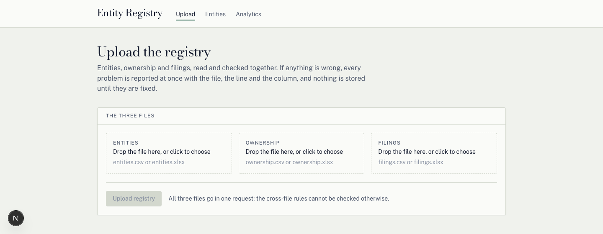

Three drop zones, one button. The button stays disabled until all three files are
attached, because a two-file upload cannot be checked and there is no reason to let
someone try. The file inputs accept only `.csv` and `.xlsx` — both formats are read the
same way, and both report true spreadsheet line numbers, so an error about "line 6" means
row 6 as Excel shows it, header included.

When the files are good, the registry is replaced and the counts come back:

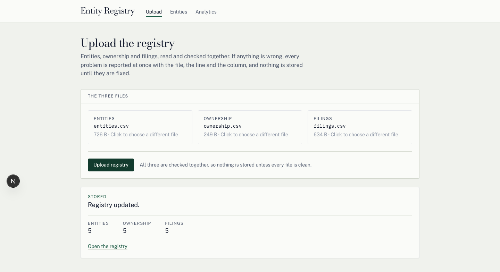

**Uploading the same files twice does nothing.** The three files are fingerprinted by
content, so an identical re-upload is reported honestly as no work done rather than as an
update:

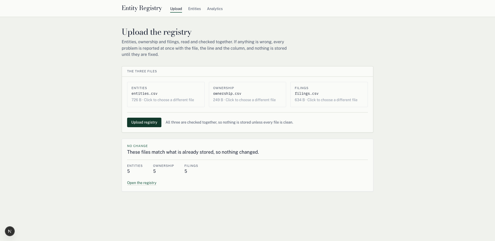

And a new upload *replaces* the registry rather than adding to it. Uploading a 5-row set
and then a 32-row set leaves 32 rows, not 37. The whole swap happens inside one
transaction.

---

## 2. When something is wrong

This is the part the application is really about.

**Every problem is reported in one pass.** Validation never stops at the first fault — it
runs every check it can still run and returns all of them together, so a user fixes their
spreadsheet once instead of playing whack-a-mole through twenty round trips.

**Nothing is written when anything fails.** A rejected upload leaves the registry exactly
as it was, down to the row.

The response is rendered as the document it is: grouped into four classes, in a fixed
order, ruled Line / Column / What to fix.

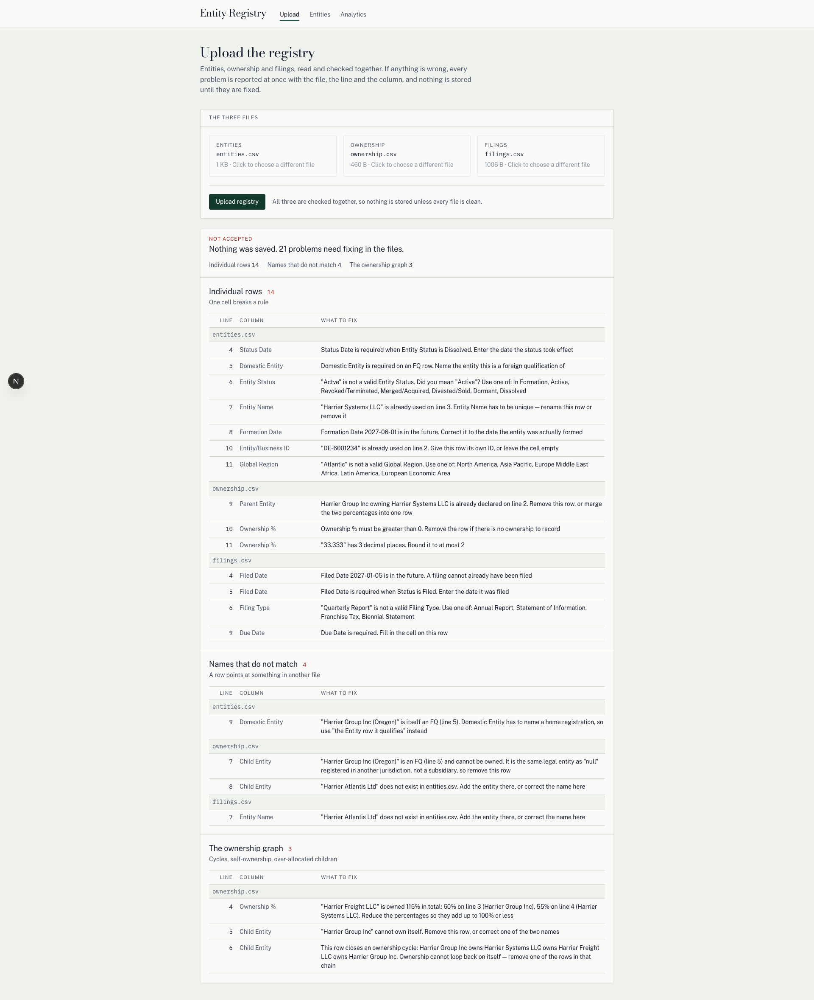

| Class | Heading | What it catches |
|---|---|---|
| `structural` | The file itself | Missing columns, unrecognised columns, wrong column order, a header with no rows |
| `row` | Individual rows | One cell breaks a rule — a bad date, an invalid status, too many decimals |
| `reference` | Names that do not match | A row points at something in another file that is not there |
| `graph` | The ownership graph | Cycles, self-ownership, a child owned more than 100% |

### The messages are written for a person, not a log

Every message names **the fix**, not the rule that fired:

> `entities.csv` line 6, Entity Status — `"Actve"` is not a valid Entity Status. Did you
> mean **"Active"**? Use one of: In Formation, Active, …

> `entities.csv` line 7, Entity Name — `"Harrier Systems LLC"` is already used on **line 3**.
> Entity Name has to be unique — rename this row or remove it.

Note what those do: the first offers a spelling suggestion, the second points back at the
line that already used the name. A user can act on either without understanding the system.

### The cases that are easy to get wrong

These are the ones worth pointing at, because a naive implementation gets each of them
subtly wrong:

- **A child owned 115% across two rows.** The error is attributed to the row that *breaks
  the ceiling*, not the first row it saw, and it names every row contributing to the total:
  *"owned 115% in total: 60% on line 3 (Harrier Group Inc), 55% on line 4 (Harrier Systems
  LLC)."*
- **A cycle.** The message prints the path, so the loop is visible rather than asserted:
  *"Harrier Group Inc owns Harrier Systems LLC owns Harrier Freight LLC owns Harrier Group
  Inc."*
- **A whole-file fault** has no line number, so the Line column shows an em-dash rather
  than a blank cell or the word `null`.
- **Cascades are suppressed.** A row already reported as malformed does not then generate
  four more errors about the names it failed to parse.

---

## 3. The registry

The list is the hierarchy. There is no detail page — the row carries what a row needs to
carry, and a click opens what is beneath it rather than navigating away.

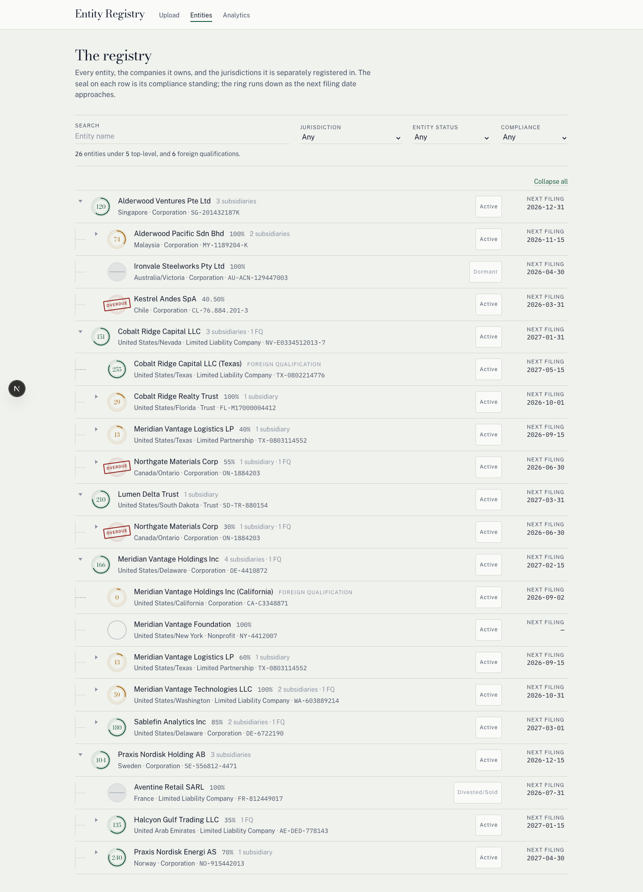

Reading a row left to right: the **seal** is compliance standing, the ring running down as
the filing date approaches; then the name, the ownership percentage or FQ label, and a
count of what is underneath; then jurisdiction, type and registration ID; then entity
status and the next filing date.

### A foreign qualification is not a subsidiary

This distinction is the core of the model, and the application keeps it everywhere:

|  | Subsidiary | Foreign qualification |
|---|---|---|
| What it is | A **different company** this entity owns part of | The **same legal entity**, registered in another jurisdiction |
| Ownership % | Yes | **Never** — you cannot own a percentage of yourself |
| In the tree | Solid rail | **Dashed** rail, plus a `FOREIGN QUALIFICATION` label |
| Can be a top-level row | Yes | No — it always hangs off its domestic entity |
| Compliance | Its own | **Its own** — it files in its own jurisdiction |

That last row is the one that matters most. An FQ is a registration in its own right, so
it has its own filings and its own standing. In the demo data Northgate Materials Corp is
`OVERDUE` while its Quebec registration is `SUSPENDED`, and a *Dormant* FQ reads
`NOT_APPLICABLE` while its Active parent reads `GOOD_STANDING`. An FQ that merely inherited
its parent's status would be a label, not a model.

### Ownership is a graph, not a tree

A company owned by two parents is genuinely in two places, so it is shown in both — each
time with **that parent's** stake. Northgate Materials Corp appears under Cobalt Ridge
Capital LLC at 55% and under Lumen Delta Trust at 30%.

Because those are two different facts, expansion is keyed by the **path taken to reach a
node**, not by its name. Opening a company under one parent does not open it somewhere
else on the page.

Cycles, self-ownership and per-child totals above 100% are all rejected at upload, which is
what lets the tree be walked without a visited-set: it is known to terminate.

**Collapse all / Expand all** sits above the tree, because surveying a forty-row group one
caret at a time is not surveying.

### Search keeps context

Filtering to a match and showing it alone would destroy the one thing this page is for.
So a match keeps its ancestors, and the ancestors are visibly dimmed to mark them as
context rather than results:

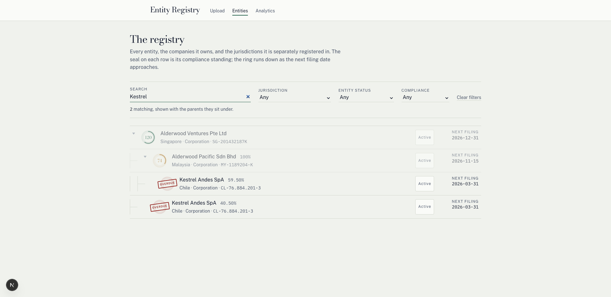

Filters offer only values that actually occur in the data, and choosing one does not empty
the others. When a combination matches nothing, the page says *that* — not that the
registry is empty, which would be a lie:

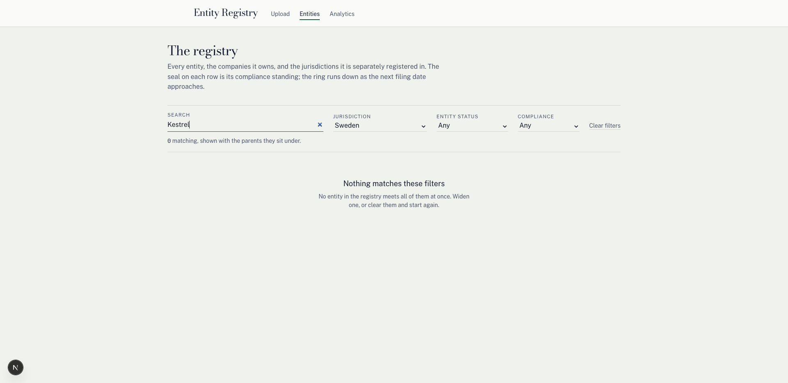

---

## 4. Compliance is derived, never stored

The file never says whether a company is in good standing. That is computed on read, from
the earliest filing for that registration that is **not** already `Filed` or `Canceled`.

The ladder is evaluated in this order — entity status first, before any date is looked at:

| Condition | Status |
|---|---|
| Dissolved, Merged/Acquired, Revoked/Terminated, Divested/Sold, Dormant | `NOT_APPLICABLE` |
| No outstanding filing | `TBD` |
| 90+ days away | `GOOD_STANDING` |
| 0–89 days away | `FILING_DUE` |
| 1–364 days past | `OVERDUE` |
| 365+ days past | `SUSPENDED` |

Two details carry real weight:

- **Order matters.** A dissolved company with a filing two years overdue is
  `NOT_APPLICABLE`, not `SUSPENDED` — it has no obligation to be behind on. Status is
  checked before arithmetic.
- **The arithmetic runs on calendar dates**, not wall-clock subtraction. A timestamp
  difference would let an entity cross the 90-day line at 2am, or skip it entirely at a
  daylight-saving transition. Boundaries are inclusive-low, and the unit tests pin all six
  of them — 90, 89, 0, −1, −364, −365 — from both sides.

An entity with no filings at all reads `TBD`. It is *unknown*, which is not the same as
compliant, and the page does not round it up to green.

---

## 5. Analytics

Four charts, and the filters are **page-level** — one set of controls that moves every
chart together, rather than a control per panel.

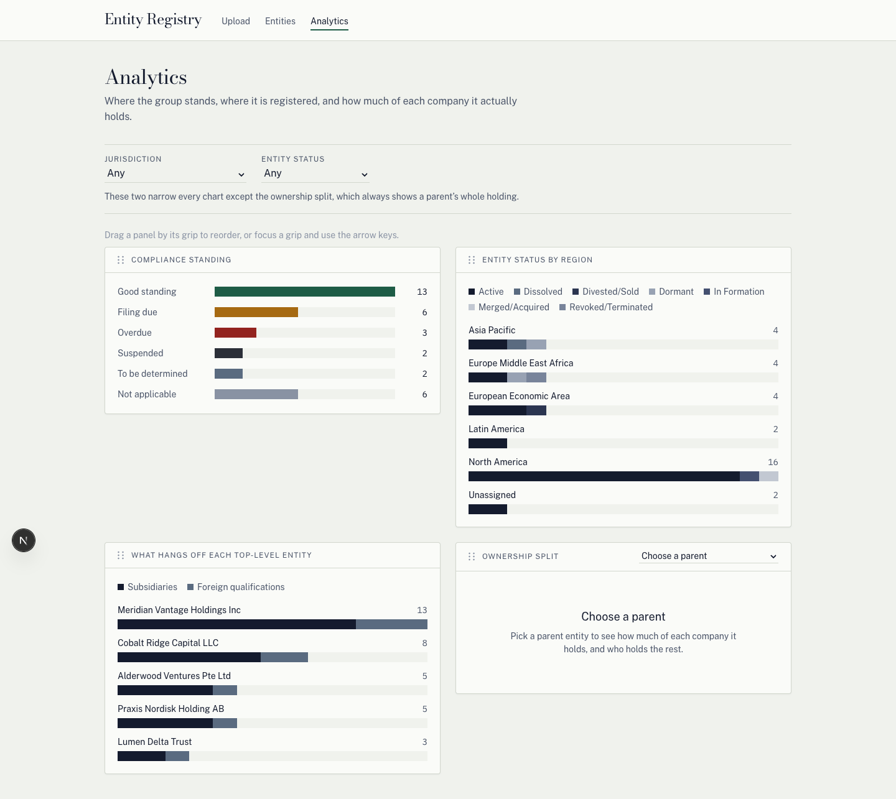

The panels can be **dragged into whatever order the reader wants** (or moved with the arrow
keys from the grip, so it works without a mouse), and the arrangement is remembered. Which
chart matters most depends on the question being asked, and the page cannot know that.

| Chart | Answers |
|---|---|
| Compliance standing | How is the group doing overall — counts sum to every registration, each counted once |
| Entity status by region | Where things are, and in what condition |
| What hangs off each top-level entity | Subsidiaries and FQs per group head, counted **separately** |
| Ownership split | For one chosen parent, how much of each company it actually holds |

Entities with no Global Region are grouped as **`Unassigned`** rather than dropped. It is a
real state in the data, and hiding it would quietly change the totals.

### The ownership chart is one bar per child

This is the chart most likely to be built wrong. It is **not** a pie across children:
percentages are capped per child and share no denominator, so a parent holding 60% of one
company and 100% of another has not allocated 160% of anything.

Each bar runs the full 0–100% of one child, split three ways:

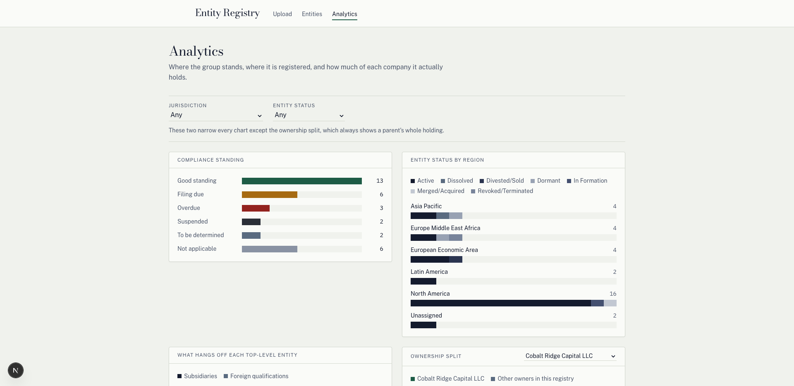

- **This parent's stake** — solid green.
- **Other owners in this registry** — solid grey.
- **Outside the registry** — the remainder, drawn as a **hatched** segment rather than a
  solid one, because it is not a holding by anyone here. Showing it as a normal colour
  would imply the group owns these companies outright.

The three always total exactly 100. The page filters deliberately **do not** narrow this
chart: `heldByOthers` is computed across every parent in the registry, so filtering by
jurisdiction would shrink it and inflate the remainder, making each bar claim the group
owns less than it does. That remainder would be an artefact of the filter, not a fact about
the company.

Before a parent is chosen the chart says so, and when a filter empties a chart it says
that too — no axes drawn around nothing:

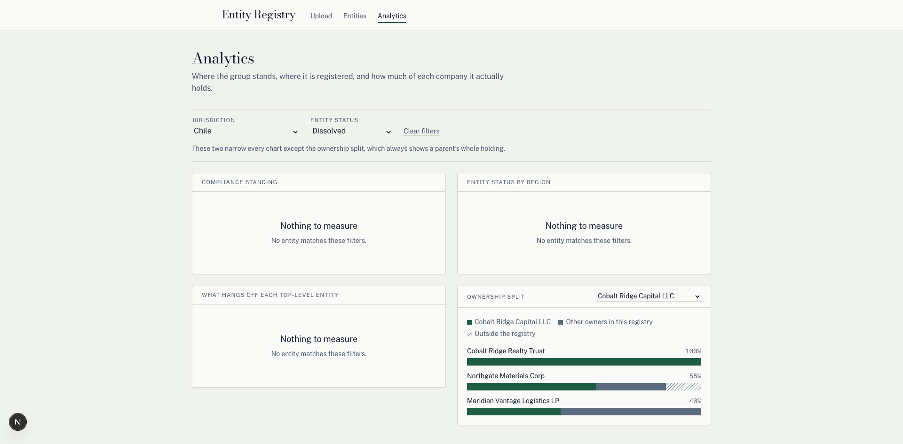

---

## 6. What it does when things go wrong

Five different situations, five different messages, none of which lies about the data:

| Situation | What the page says |
|---|---|
| Nothing uploaded yet | "No registry yet" + a link to upload |
| Filters match nothing | "Nothing matches these filters" |
| A chart has no data | "Nothing to measure" |
| No parent chosen | "Choose a parent" |
| The API is unreachable | "The registry could not be read" + **Try again** |

That last one matters most. If the API is down, the page says so and offers a retry — it
does not hang, and it does not render an empty registry, which would be a lie about the
data rather than a report about the connection:

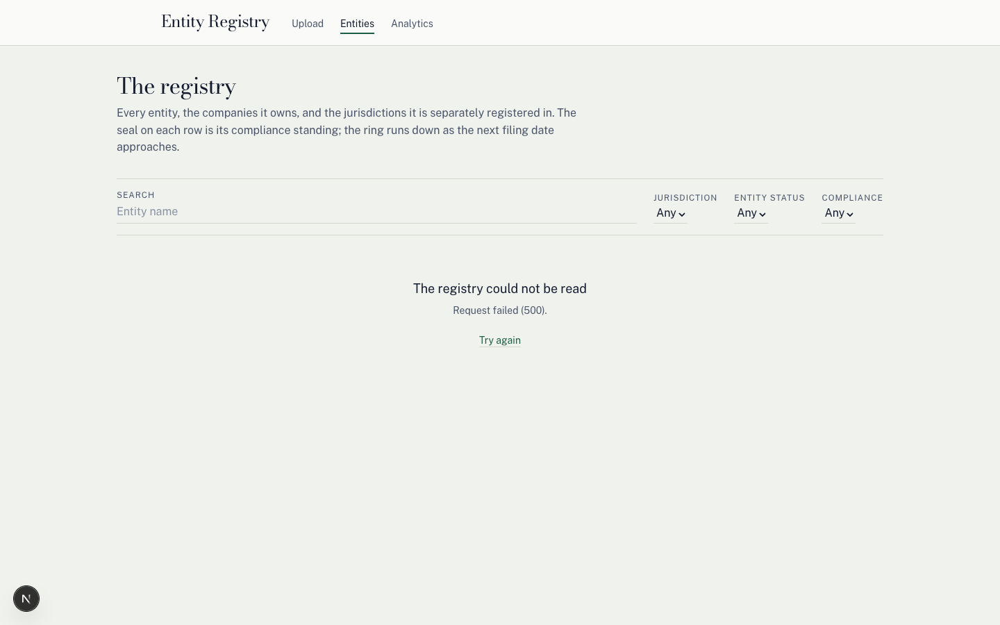

---

## 7. Quality floor

- **Responsive.** At 390px there is no horizontal scroll on any page. The status pill and
  the filing-date column give up their space, and both facts move into the row body rather
  than disappearing.
- **Keyboard.** A real `role="tree"` with `aria-level` and `aria-expanded`, tab order in
  document order, and a visible focus indicator on every control.
- **Screen readers.** Rows read as *"Suspended. Overdue by 579 days."* — status is carried
  in text, never by colour or animation alone. Chart segments carry their own descriptions.
- **Reduced motion.** The seal's draw-in is disabled under `prefers-reduced-motion`, and
  the final state is what the server already rendered — so nothing is *conveyed* by the
  animation.
- **Console.** No errors, no React key warnings, no hydration mismatches.

---

## The stack, and why

| Part | Tech | Dev port |
|---|---|---|
| `apps/web` | Next.js 15 (App Router), React 19, Tailwind, TypeScript | 3000 |
| `apps/api` | NestJS 11, Prisma, SQLite, TypeScript | 4001 |

SQLite is a deliberate choice. A corporate group is tens of rows, not millions; the charts
read it in three queries and hold it in memory, which is the honest shape of the data. More
to the point, it means someone else can clone this and have it running in three commands
with no database server to install:

```bash
pnpm install     # also generates the Prisma client
pnpm db:setup    # writes apps/api/.env and creates the SQLite file
pnpm dev         # web on :3000, API on :4001
```

`apps/api/src/registry` is where that assumption lives, if it ever stops being true.

---

*A full 45-check verification of the behaviour described here — run against a fresh clone,
with evidence — is in [`E2E-REPORT.md`](./E2E-REPORT.md).*
